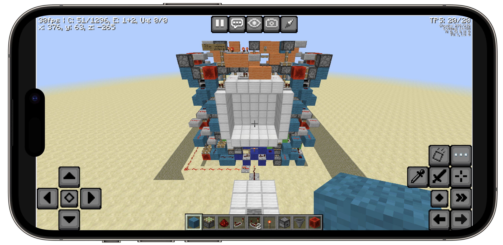

# </img>Eagler Mobile


[](https://github.com/FlamedDogo99/EaglerMobile/releases)
[![Eaglercraft.com](https://img.shields.io/endpoint?url=https%3A%2F%2Fcellshield.info%2Fgs%3FspreadSheetId%3D1rkNuoBtzxp2m_psnMBCyaWw2BujITghrqE_2cKB6eW0%26cellRange%3DB3&style=flat-square&logo=data%3Aimage%2Fpng%3Bbase64%2CiVBORw0KGgoAAAANSUhEUgAAACAAAAAgCAMAAABEpIrGAAABAlBMVEUAAAAAAAAwIRZPNyYkGRA6KBs9LB5jRjB5VzxLNiVoqD4%2FaCVsrEJbQCwrRBqXxmdmpzwnQBZ3t01zs0lxsUdwr0Zqqj9fnzRblzSGtVZlpTtjozhhoTdDbChHMSIuSR11tUssLCygz3CUw2SSwWGKuVp8vFJggEFgmzhcnDI7Tic1JRij03ONvF1YWFiBsFF5uU56p0xGRkZvUDdWdDZLdi9KdC5AUyxVlStGcCs0SCEkPRWcyW2IyF6Is1uDw1mHtleDrlZ9rE10okZnhUZYmC5Xly0%2BUSo5Yx2q2XqRvGSPvl9uqUdurkRvm0NAQEBZdTxaeTtUfjc3NzdPiig4SyTTBcNjAAAAAnRSTlMAJEqQKekAAAIRSURBVDjLfI7nbsIwFIUxxKKKrWzbmU1ISEIoCJDYo%2BzRPdS%2B%2F6vUJW3VJc79%2BX333lP4FQAKpwIug2QJTmBbruIFMcH%2F2HQVhbE4SYJgCv7ie8ZW9t3MmWHDiGNdBD9xjYlbQ3YVJzKUqxU1bMO9Bt%2FwbkdItSqGiqxZVhSFoaZROnwBOe4Mqavzds6woViMzjNXxvhG47Img3cBoVqHBhHTSZat5cA1CF6ElqMlRFVz4anr1USMRR5qaI68bVuMkI4kSZOjcLHpdj1kiqKitFr2lNrOvG3dqmrd93PhYeONPIQeTRHreowbzWbbVCUu7PfCUTiHsN%2BHvTT1zFam63ZzORkLkuDXBaGYvyif9SHsPac9hNZ6w1Rfx2PBF7jzJZRhuYTgKIUHD%2FFqA5UznkrlQyiV%2BUA4gvCAoC8MBny%2FyNc%2FL7wVTja3DsMwDAZM%2FVCHrBCgC%2BSQjvL23%2BVRtg9FgbZCYh%2F0kYyA6Elc6aobOpSsGkNP1QIOMgEHbqTDHhYlpEZFbGBGEPQJjFBJbTHGBqRvCxIAw9RWRV%2FnBgiHp0%2BjDv9rpF%2FfEWwCmdBR1uHC%2BlrAqQ4VTzRXrbWKxwzaDhIyb6qAFtcQoPb%2BhickTkGqK%2BcEpabZdmhkzdEMBEREhQh%2F%2BSuPy%2BEU4WuAsK1%2BQQAKYVi0%2B1K%2FI05yWOd%2F2K0TSLmfX7bzyHjL%2Frn%2B%2FymZL56MQephAAAAAElFTkSuQmCC&label=eaglercraft.com)](https://docs.google.com/spreadsheets/d/1rkNuoBtzxp2m_psnMBCyaWw2BujITghrqE_2cKB6eW0/edit?usp=sharing)
[](https://github.com/FlamedDogo99/EaglerMobile/blob/main/LICENSE)

## About

Eagler Mobile brings new functionality and benefits for the EaglerCraft web client by providing mobile-friendly touch controls, keyboard access, and other settings configurable through the EaglerCraft client.

<div align="center">



</div>

> [!IMPORTANT]
> Currently all developement is focusing on the 1.8.8 client, however functionality will be brought to previous versions soon.

## Installation

The easiest way to use Eagler Mobile is to use a userscript application such as Greasemonkey, however since Eagler Mobile is plain JavaScript you can easily deploy it in other ways as well. As an example we've included `eaglermobile.ef.js` which can be run as a mod on [EaglerForge](https://github.com/eaglerforge/EaglerForge).

<details>
<summary>See more examples</summary>

---

1. **Self hosted**

If you are hosting the EaglerCraft client on your own server, you can include the mobile script in the `index.html` folder as a script.

```js
<script type="text/javascript" src="yourDirectory/eaglermobile.user.js"></script>

```

2. **Other userscript applications**

Non-mobile browsers:
 - Chrome, FireFox, Safari, Edge, Opera Next, Microsoft Edge: [Tampermonkey](https://www.tampermonkey.net)

iOS:
- Safari: [Userscripts](https://apps.apple.com/us/app/userscripts/id1463298887)
- Orion: [Tampermonkey](https://www.tampermonkey.net)

Android:
- FireFox: [Tampermonkey](https://www.tampermonkey.net)
- Kiwi Browser: [Tampermonkey](https://www.tampermonkey.net)

---

</details>

If you want to download the source, no building is required. The best way to download the source is with Git:

```sh
git clone https://github.com/FlamedDogo99/EaglerMobile.git
```

## Controls

Eagler Mobile provides a variety of mobile controls and gestures to navigate the EaglerCraft client. While many controls mimic Minecraft Pocket Edition's controls, other controls have been added to interact with Minecraft Java Edition features.

<details>
<summary>See list of controls</summary>

|Input / Gesture|Result|Additional Details|
|:-:|:- |:- |
|| Walk forwards | **On Press**: Shows strafe buttons |
|| Strafe left | Hidden without walking forward |
|| Strafe right | Hidden without walking forward |
|| Walk left |
|| Walk right |
|| Walk backwords |
|| Jump | **Double Tap**: Fly
|| Crouch | **On Hold**: Locks button |
|| Sprint | **On Hold**: Locks button |
|| Break block |
|| Place block |
|| Select block |
|| Open inventory |
|| Drop item |
|| Scroll left |
|| Scroll Right |
|| Pause |
|| Open chat |
|| Change perspective |
|| Take screenshot |
|| Toggle coordinates |
|| Go back |
|| Toggle keyboard |
|Short touch| Primary click | **On Drag**: Mouse movement
|Long touch| Secondary click | **On Drag**: Mouse movement
|Two finger touch| Scroll |

</details>


> [!WARNING]
> Because Eagler Mobile does not directly inject code into the EaglerCraft client, Eagler Mobile's touch controls only work for the standard control scheme that the EaglerCraft client is set to start with. Editing the controls in the EaglerCraft client could create unintended behavior. 

## Contributing

### Suggestions and bug reports

If you found a bug or have a suggestion [create an issue](https://github.com/FlamedDogo99/EaglerMobile/issues/new/choose) after checking for duplicates.

### Code

Before contributing code, please read our [contributing guidelines](https://github.com/FlamedDogo99/EaglerMobile/blob/main/.github/CONTRIBUTING.md).

### Features and documentation
#### Fake API's
- Pointerlock methods such as `Element.prototype.requestPointerLock`, `document.pointerLockElement`, and `document.exitPointerLock` are replaced with vanilla JavaScript that mimics pointerlock functionality. This allows the EaglerCraft client to load.
- Fullscreen methods such as `Element.prototype.requestFullscreen`, `document.fullscreenElement`, and `document.exitFullscreen` are replaced with vanilla JavaScript that mimics fullscreen functionality. This fixes a crash due with viewport dimensions.

#### Keyboard Events
- The EaglerCraft client captures keypress through a `keydown` event listener. Because Android devices currently have an issue with `keydown` and `keyup` events, Eagler Mobile dynamically toggles between capturing `keydown` and `input` events. The state is saved in window.keyboardFix, and is toggled if a faulty keyboard event is detected.
- To dispatch keyboard events, Eagler Mobile requires the use of the `keyEvent` function, in order to maintain functionality for `input` event listeners. For example, typing an uppercase `h` in the chat is as simple as:
  ```js
  keyEvent("shift", "keydown");
  keyEvent("h", "keydown");
  ```
#### Mobile controls
- Eagler Mobile controls can either be shown in-game or in-menu. When creating a an element you can achieve this simply by either adding the `inGame` or `inMenu` class.
- Simple gesture controls such as scrolling, single pressing, and long pressing have been implemented, however there are currently no functions provided to easily bring this functionality to other elements.

#### File uploads
- On MacOS and iOS safari, the EaglerCraft client's implementation of triggering the file selection dialog does not work. A rudimentary fix has been added for now.

## License

Eagler Mobile is licensed under the terms of the [Apache License, Version 2.0](https://github.com/FlamedDogo99/EaglerMobile/blob/main/LICENSE).

## Intended future features
- [ ] **Gamepad support**: Mapping gamepad inputs to `keyEvent`, `wheelEvent` and `mouseEvent` functions, and implenting a controllable fake cursor for menus.
- [ ] **File upload improvements**: Adding a cancel button and improving the styling
- [ ] **Dynamic enable and disable of features**: Seperating gamepad controls, touch controls, pointerlock fix, and upload fix into seperate functions which can be enabled and disabled by the user
